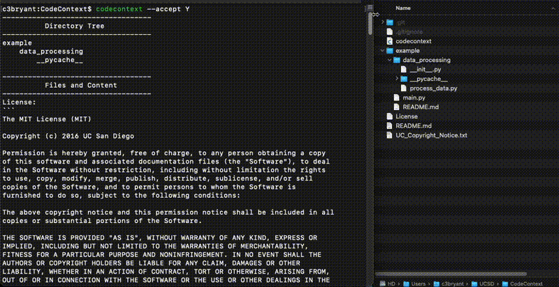

# Code Context

<p align="center">
    
</p>

## About
**Code Context** is a command-line interface (CLI) tool, crafted in BASH, that offers a comprehensive overview of your project by capturing and detailing its directory structure and file contents. Designed to provide deep insights into the project's context, it facilitates an understanding of the project's architecture and content makeup.

By utilizing the `--path` parameter, users can tailor the tool to focus on specific areas of the project, allowing for detailed exploration of particular directories or files.

**Version:** 1.1.0  
**Author:** c3bryant@ucsd.edu  
**Language:** BASH  

## Usage
Run 'codecontext' with optional flags to obtain a detailed view of your project's structure and content.

```sh
$ codecontext [--accept] [--path PATH] [--help]
```

### Options
- **-a, --accept**: Accept the campus notice and continue.
- **-p, --path**: Specify a particular path within the project for targeted context exploration (defaults to the current directory).
- **-h, --help**: Display help information.

## Installation
Ensure that the script is globally accessible and executable.

1. Move the script to your PATH:
```sh
sudo mv codecontext /usr/local/bin/codecontext
```
2. Make the script executable:
```sh
sudo chmod +x /usr/local/bin/codecontext
```

## Features
- Offers a detailed context of your project, either in full or focused on specific parts, by providing insights into the directory tree and file contents.
- Capable of handling various file types and directories to ensure a comprehensive overview.

## Limitations
- The project directory must contain fewer than 1000 files.
- Does not include hidden folders and files.
- Excludes third-party dependencies, lock files, tests coverage, and log files.
- Limited to supporting plain text files.